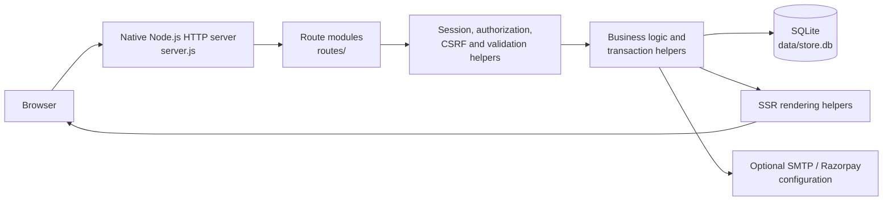

# PrintOasis

PrintOasis is a full-stack commercial-printing storefront for discovering configurable print products, placing orders, and managing fulfilment from one application.

## Overview

The project gives customers a complete print-commerce flow: browse a searchable catalogue, configure products, upload artwork, reserve inventory in a cart, check out with cash on delivery or a configured Razorpay flow, track orders, manage addresses, save a wishlist, and leave verified-purchase reviews.

Administrators use the same application to manage products, images, stock, visibility, coupons, order status, tracking details, and notification history. The application is built with native Node.js HTTP, SQLite, server-side rendered HTML, and modular route handlers.

## Demo and Screenshots

Repository screenshots have not been committed yet. Add verified product screenshots under `docs/screenshots/` and reference them here with relative paths, for example:

```md

```

## Key Features

- Searchable product catalogue with category filters, configurable product options, featured products, and hidden-product exclusion.
- Admin product CRUD, image upload, stock management, visibility controls, and featured-product controls.
- Session-backed cart with artwork uploads for PDF, PNG, AI, and PSD files.
- Reservation-based inventory: cart activity changes reserved stock; physical stock is deducted only when an order is created.
- Checkout with address validation, shipping calculation, GST invoice view/print, cash on delivery, and a Razorpay-ready online-payment flow.
- Order history, status timeline, shipment tracking, cancellation/restocking, and notification records.
- Verified-purchase reviews, rating statistics, wishlist, saved addresses, password changes, and coupons.
- Configurable Nodemailer SMTP delivery with a local email outbox fallback.
- Password-hashed accounts, server-side sessions, CSRF-protected forms, authorization checks, and SSR output escaping.
- Responsive vanilla HTML/CSS/JavaScript UI with dark mode, mega navigation, and image-library support for galleries and card hover images.

## Technical Highlights

| Area | Implementation |
| --- | --- |
| HTTP layer | A native Node.js `http` server in `server.js`; no Express dependency. |
| Rendering | Server-side HTML rendering helpers generate pages from SQLite-backed data. |
| Routes | Focused modules in `routes/` handle authentication, products, cart, checkout, accounts, admin, and static assets. |
| Inventory | `available = stock - reserved`; `BEGIN IMMEDIATE` transactions protect reservation, checkout, and restock changes. |
| Data access | SQLite through Node's built-in `node:sqlite` API with parameterized statements and foreign keys enabled. |
| Security | Password hashing with `scrypt`, HTTP-only session cookies, CSRF tokens, role checks, HTML escaping, safe upload checks, and Razorpay signature verification. |
| Images | A WebP-first library resolver supports primary, hover, gallery, category, and section-specific images while preserving legacy uploads. |

## Tech Stack

| Technology | Purpose |
| --- | --- |
| Node.js 22.5+ | Application runtime. |
| Native Node.js HTTP | Request handling and HTTP responses without a web framework. |
| `node:sqlite` | SQLite persistence for users, products, sessions, carts, orders, coupons, reviews, and related records. |
| HTML, CSS, JavaScript | Server-rendered UI, responsive styling, and progressive browser interactions. |
| Server-side rendering | Generates the storefront and admin HTML on the server for every request. |
| Nodemailer | Optional SMTP delivery for order and contact notifications. |
| Razorpay API | Optional configured online-payment integration. |
| Docker / Render Blueprint | Included deployment configuration. |

## Architecture



`server.js` owns application bootstrap, database initialization, shared helpers, and page-rendering functions. It dispatches requests to route modules. A route validates the request and calls shared business logic; the server queries SQLite, renders HTML, and writes the HTTP response. Static assets and uploaded product images are served by `routes/static.js`.

## Project Structure

```text
.
├── server.js                         # Bootstrap, schema, shared logic, SSR helpers
├── catalog.js                        # Starter seed catalogue and category configuration
├── routes/
│   ├── auth.js                       # Registration, login, logout, Google sign-in
│   ├── products.js                   # Home, catalogue, product, search, wishlist, reviews
│   ├── cart.js                       # Cart operations, reservations, artwork uploads
│   ├── checkout.js                   # Checkout, payment endpoints, invoices
│   ├── account.js                    # Account, orders, tracking, trust/contact pages
│   ├── admin.js                      # Admin products, coupons, orders, notifications
│   └── static.js                     # Public assets, uploaded images, health check
├── services/email.js                 # SMTP service and order-email templates
├── public/
│   ├── app.js                        # Browser interactions
│   ├── styles.css                    # Responsive UI styles
│   └── assets/images/                # WebP-first image-library directory structure
├── scripts/
│   ├── sprint3-smoke.js              # Sprint 3 feature verification script
│   └── cleanup-inventory-smoke.js    # Inventory smoke-test cleanup helper
├── docs/
│   ├── DEPLOYMENT.md                 # Render/Docker deployment notes
│   ├── GITHUB-AND-CLIENT.md          # Client sharing and GitHub notes
│   └── SOURCE-GUIDE.md               # File-by-file source map
├── IMAGE_LIBRARY.md                  # Image resolver and naming contract
├── IMAGE_ASSET_MANIFEST.md           # Planned image-library inventory
├── PHASE_B_IMAGE_PRODUCTION_SPEC.md  # Premium asset-production brief
├── .env.example                      # Safe configuration template
├── Dockerfile                        # Container build
├── render.yaml                       # Render Blueprint
└── package.json                      # Scripts, dependencies, runtime requirement
```

`data/` and `invoices/` are runtime output locations and are intentionally ignored by Git.

## Core Technical Concepts

### Inventory Reservation

PrintOasis separates warehouse stock from cart reservations:

```text
available = stock - reserved
```

- Adding to cart reserves quantity without reducing physical `stock`.
- Increasing or decreasing cart quantity adjusts only the reservation delta.
- Removing an item, logging out, or expiring a session releases its reservation.
- `createLocalOrder()` runs inside `BEGIN IMMEDIATE`, creates the order, decrements both `stock` and `reserved`, records order items, applies coupon accounting, and clears the cart atomically.
- Cancelling an order uses `restoreOrderInventory()` and its `inventory_restocked` guard to restore physical stock once.

### Checkout

The checkout route requires an authenticated user and a valid CSRF token. It re-reads the cart, calculates totals and coupons, validates inventory during the transaction, then creates an order and its line items. Cash on delivery calls the local order flow directly. The configured Razorpay path creates a provider order, verifies the returned HMAC signature server-side, then calls the same local order flow. A failed payment releases the session's reservations.

### Authentication and Sessions

Accounts use `scrypt`-hashed passwords. `sessions` are stored in SQLite and represented by a random, HTTP-only, `SameSite=Lax` cookie. Each session has a CSRF token and a 30-day expiry. `requireAuth()` protects customer pages; `requireAdmin()` additionally checks `users.is_admin` for admin pages. Google sign-in is configuration-dependent and validates the ID token server-side when `GOOGLE_CLIENT_ID` is configured.

### Security

Current protections include parameterized SQLite statements, enabled foreign keys, escaping for rendered HTML, CSRF validation on protected form submissions, authorization checks, filename/path checks for served or uploaded content, upload allowlists and size limits, HTTP-only session cookies, and Razorpay signature verification.

Current limitations: SQLite-backed sessions and locking are appropriate for this single-instance project but are not a horizontally scaled session store; the repository does not include rate limiting, a full CSP/security-header policy, or an automated security scanner. Live Google, Razorpay, and SMTP use require real provider credentials and production configuration.

### Orders, Tracking, Reviews, and Coupons

Orders progress through `Pending`, `Printing`, `Packed`, `Shipped`, `Delivered`, or `Cancelled`. Admin status updates can record courier, tracking number, URL, and estimated delivery; customers can view tracking and invoices from their account. Reviews require a delivered purchase and prevent duplicate product reviews. Coupons store active state, dates, order thresholds, maximum discounts, limits, and usage accounting, which increments only within successful order creation.

### Image Architecture

The image system is prepared for a reusable asset library rather than one image per product. It supports `primary`, `hover`, gallery, category, and placement-specific images with a WebP-first resolver and safe JPG/JPEG/PNG legacy fallback. See [IMAGE_LIBRARY.md](IMAGE_LIBRARY.md), [IMAGE_ASSET_MANIFEST.md](IMAGE_ASSET_MANIFEST.md), and [PHASE_B_IMAGE_PRODUCTION_SPEC.md](PHASE_B_IMAGE_PRODUCTION_SPEC.md).

The infrastructure is implemented. Premium final product photography described in the manifest and Phase B specification is a planned content-production task, not a claim that every asset already exists.

## Request Lifecycle

```text
Browser request
  -> server.js creates/loads the session and parses POST data
  -> matching route module handles the URL and method
  -> route checks authentication, authorization, CSRF, and input
  -> shared helpers run SQLite queries and business rules
  -> SSR helper produces HTML (or a JSON/static response)
  -> native HTTP response returns to the browser
```

## Installation and Local Setup

**Prerequisite:** Node.js `>=22.5.0` (required by `package.json`).

```powershell
git clone <your-repository-url>
cd PrintOasis-GitHub-Source
npm install
Copy-Item .env.example .env
npm start
```

Open `http://localhost:3000`. On first start, the application creates the SQLite database at `data/store.db`, applies its `CREATE TABLE IF NOT EXISTS` schema, and seeds the starter catalogue.

For local client previews, run:

```powershell
npm run share
```

This uses the existing `share-preview.ps1` script and produces a temporary public preview URL. It is not permanent hosting.

## Environment Variables

Copy `.env.example` to `.env`; never commit the resulting `.env` file.

| Variable | Purpose | Required locally? |
| --- | --- | --- |
| `BASE_URL`, `PORT`, `DATA_DIR` | Public base URL, port, and runtime-data directory. | `PORT` is optional; the defaults work locally. |
| `ADMIN_EMAIL`, `ADMIN_PASSWORD` | Initial/admin account configuration. | Change for production. |
| `EMAIL_DELIVERY_ENABLED`, `EMAIL_FROM` | Enables delivery and defines sender identity. | Optional. |
| `SMTP_HOST`, `SMTP_PORT`, `SMTP_SECURE`, `SMTP_USER`, `SMTP_PASS` | Nodemailer SMTP configuration. | Optional; otherwise email is logged to the outbox. |
| `EMAIL_WEBHOOK_URL` | Optional notification webhook fallback. | Optional. |
| `SUPPORT_EMAIL`, `SUPPORT_PHONE`, `OFFICE_ADDRESS`, `CONTACT_RECIPIENT` | Customer-facing support and contact-enquiry details. | Optional; defaults exist. |
| `GOOGLE_CLIENT_ID`, `GOOGLE_CLIENT_SECRET`, `GOOGLE_REDIRECT_URI` | Google provider configuration template. | Optional; sign-in UI is configuration-dependent. |
| `RAZORPAY_KEY_ID`, `RAZORPAY_KEY_SECRET` | Razorpay online-payment configuration. | Optional; required only for the provider flow. |

## Testing and Validation

The repository does not use Jest, Vitest, Cypress, or a CI workflow. Its current validation commands are:

```powershell
npm run check
powershell -ExecutionPolicy Bypass -File .\smoke-test.ps1
powershell -ExecutionPolicy Bypass -File .\inventory-smoke-test.ps1
```

`npm run check` runs Node syntax checks across the server, routes, email service, and browser JavaScript. The PowerShell smoke scripts start a local test server and exercise customer/order flow and inventory reservation behaviour. `scripts/sprint3-smoke.js` provides additional direct checks for Sprint 3 functionality when run against its configured test server.

## Deployment

The repository includes a [Dockerfile](Dockerfile), [Render Blueprint](render.yaml), and [deployment guide](docs/DEPLOYMENT.md). The included Render configuration mounts `/var/data` for SQLite, uploads, sessions, carts, and email outbox persistence. Configure secrets in the host's environment settings, not in Git.

Google, Razorpay, and SMTP are implementation-ready but configuration-dependent; this repository does not claim a live payment deployment or a CI/CD pipeline.

## Design Decisions

| Decision | Why it fits this project | Trade-off |
| --- | --- | --- |
| Native Node HTTP, not Express | Keeps the request lifecycle explicit and dependency surface small. | More routing and middleware responsibilities are implemented manually. |
| SQLite | Simple local persistence for a single deployed service and easy developer setup. | Not the long-term choice for high write concurrency or multi-instance deployment. |
| SSR plus vanilla JS | Fast first HTML response, straightforward SEO-friendly markup, and no client framework build step. | UI composition is less componentized than a framework application. |
| Reserved inventory | Prevents a cart from reducing physical stock while still protecting available quantity. | Requires careful release paths for cart changes, logout, expiry, failure, and cancellation. |
| Modular routes | Keeps feature request handlers separate while retaining shared rendering/business logic. | `server.js` remains the central application module. |

## Current Status

**Implemented:** the core print-commerce storefront, admin workflow, reservation-based inventory, checkout and COD, configured Razorpay integration path, order tracking, reviews, coupons, image-library infrastructure, trust/support pages, Docker/Render configuration, and local smoke checks.

**Configuration-dependent:** live SMTP delivery, Google sign-in, Razorpay payments, public sharing, and hosted deployment require the correct credentials, approved accounts, and environment variables.

**Future / production-scale improvements:** PostgreSQL, Redis, object storage, CDN delivery, background workers, stronger payment idempotency, observability, rate limiting, and CI/CD are not current implementation details.

## Documentation

- [Source guide](docs/SOURCE-GUIDE.md)
- [Deployment guide](docs/DEPLOYMENT.md)
- [GitHub and client sharing guide](docs/GITHUB-AND-CLIENT.md)
- [Image library contract](IMAGE_LIBRARY.md)
- [Image asset manifest](IMAGE_ASSET_MANIFEST.md)
- [Phase B image-production specification](PHASE_B_IMAGE_PRODUCTION_SPEC.md)

## Author / Project

PrintOasis is an interview-ready full-stack print-commerce project maintained as a single Node.js and SQLite application.
